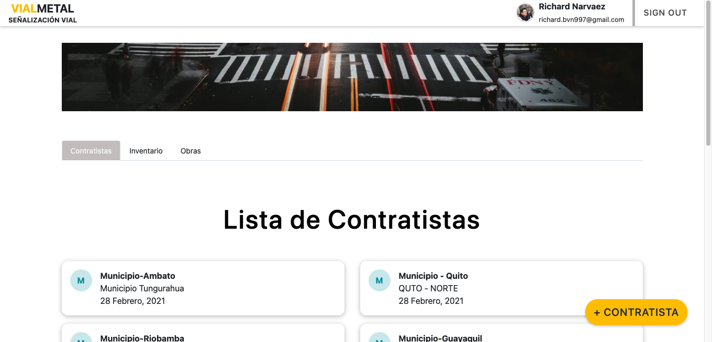
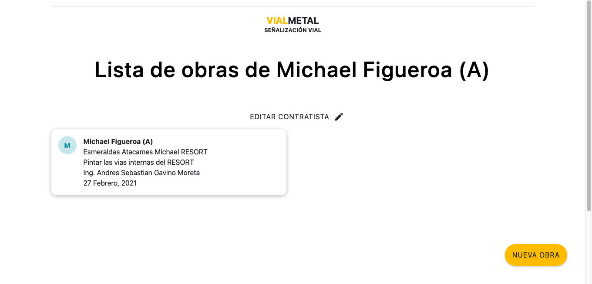
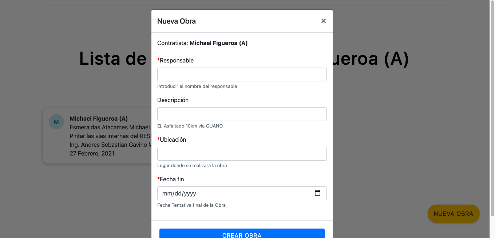
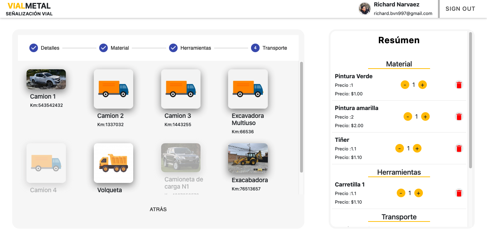
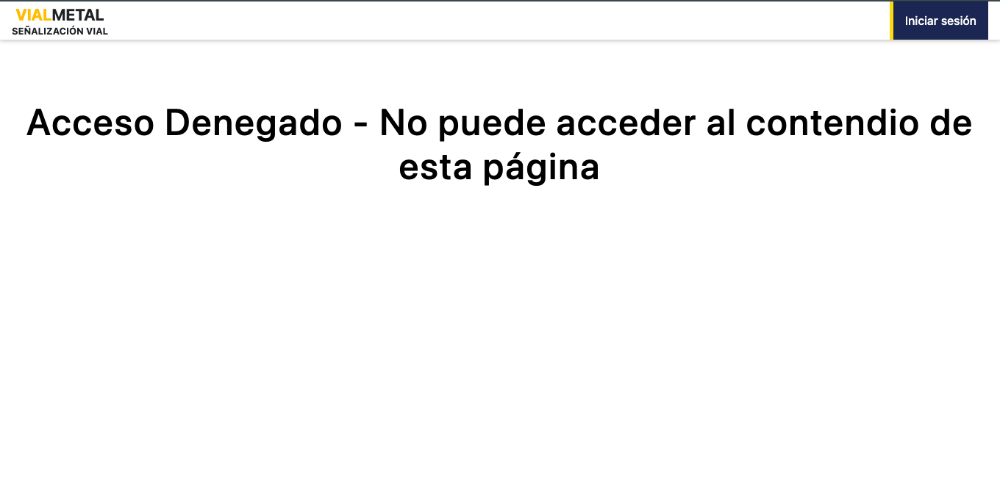

# VIALMETAL
This is a [Next.js](https://nextjs.org/)
## EMPEZAR
Necesitamos NODEJS instalado. version LTS

Una vez este listo 
First, run the development server:

```bash
npm i
npm run dev
```

Se abrira el servidor [http://localhost:3000](http://localhost:3000).

You can start editing the page by modifying `pages/index.js`. The page auto-updates as you edit the file.

[API routes](https://nextjs.org/docs/api-routes/introduction) can be accessed on [http://localhost:3000/api/users](http://localhost:3000/api/users). This endpoint can be edited in `pages/api/hello.js`.

The `pages/api` directory is mapped to `/api/*`. Files in this directory are treated as [API routes](https://nextjs.org/docs/api-routes/introduction) instead of React pages.

| Login | 
| :-:   | 
|  |

| Login | Home |
| :-:   | :-: | 
|  |  |

| Login | Home |
| :-:   | :-: | 
|  |  |

| Login | Home |
| :-:   | :-: | 
|  |  |


## EQUIPO
- [Michael Figueroa](https://github.com/07MichaelF)
- [Andres Gavino](https://github.com/AndresGav)
- [Jhoset Pazmiño](https://github.com/Jhosetp96)
- [Johnny Gaona](https://github.com/Gamerpain)
- [Daniel Molina](https://github.com/gatodante12)
- [Carlos Diaz](https://github.com/username)
- [Richard Vinueza](https://github.com/richardnarvaez)
- [Nixon Ramos](https://github.com/NRamosD)
